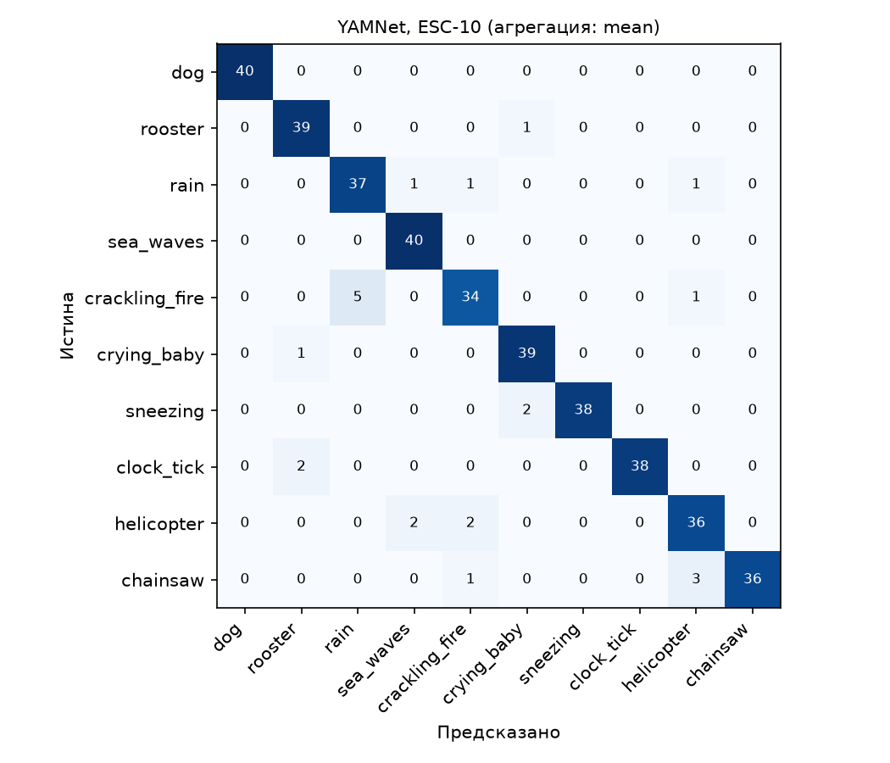

# Задача 2. Классификация звуков (YAMNet)

Часть серии заданий 1 по дисциплине «Программная инженерия» (ПрИнж 24/25, семестр 1).
Тип задачи: **обработка аудио**. Фреймворк: **TensorFlow / TensorFlow Hub**.

## Техническое задание

| | |
|---|---|
| **Цель** | Автоматически определять тип окружающего звука в аудиозаписи |
| **Вход** | Аудиофайл WAV (любая частота дискретизации, моно или стерео), запись около 5 с |
| **Выход** | Один из 10 классов (`dog`, `rooster`, `rain`, `sea_waves`, `crackling_fire`, `crying_baby`, `sneezing`, `clock_tick`, `helicopter`, `chainsaw`), оценка `score`, а также 5 лучших классов YAMNet из 521 |
| **Ограничения** | Готовая модель без дообучения; локальный запуск (CPU / Apple Silicon) |
| **Критерий качества** | Macro-F1 в задаче на 10 классов не ниже 0.70 |

## Модель

**YAMNet** — предобученная нейросеть из TensorFlow Hub (`https://tfhub.dev/google/yamnet/1`), архитектура MobileNet v1 на основе depthwise-separable сверток. Она обучена на корпусе AudioSet и предсказывает 521 класс звуковых событий (например, смех, лай, сирена). Вход: звуковая волна 16 кГц, моно; выход: оценки 521 класса для каждого кадра (~0.48 с).

**Как это превращается в нашу задачу.** YAMNet напрямую не знает «наших» 10 классов, поэтому классы ESC-10 сопоставлены классам YAMNet (словарь `ESC10_TO_YAMNET` в `yamnet_classifier.py`; например, `rain` → «Rain», «Raindrop», «Rain on surface»). Для файла оценки по кадрам усредняются (можно выбрать максимум), для каждого из 10 классов берётся наибольшая оценка среди сопоставленных классов YAMNet, и побеждает лучший класс.

Оценки YAMNet не калиброваны между классами, поэтому `score` не является вероятностью: это условная мера уверенности, сравнивать её имеет смысл только внутри одной модели.

## Датасет

**ESC-50** — набор из 2000 пятисекундных записей окружающих звуков, 50 классов по 40 записей. Используется подмножество **ESC-10**: 10 классов, 400 записей (по 40 на класс). Записи в формате WAV, 44.1 кГц, моно.

- Метки заданы авторами датасета (`meta/esc50.csv`).
- Модель не обучается, поэтому все 400 записей используются как тестовые (деление на фолды не требуется).
- Данные скачиваются скриптом `download_esc10.py` (~175 МБ) в `data/ESC-50/`. В Git эту папку **не добавляем** (см. ниже).

## Метрики

- **Задача на 10 классов:** accuracy, precision / recall / F1 по классам, **macro-F1**, матрица ошибок, 95% доверительные интервалы (bootstrap, 1000 повторов).
- **Открытая задача (все 521 класс YAMNet):** top-1 и top-5 — попадает ли лучший (или один из пяти лучших) класс YAMNet в набор классов, сопоставленных истинному классу. Эта метрика показывает, насколько сама модель «согласна» с разметкой без ограничения выбора десятью классами.
- **Скорость:** миллисекунд на запись (чтение файла + инференс).
- **Анализ порога оценки:** охват и точность при отбрасывании записей с низким `score`.
- Сравнение двух способов агрегации оценок по кадрам: `mean` и `max`.

## Установка и запуск

```bash
cd audio
python -m venv .venv
source .venv/bin/activate          # Windows: .venv\Scripts\activate
pip install -r requirements.txt
```

Если `pip` не находит подходящую версию TensorFlow, используйте Python 3.11 или 3.12.

Скачать данные и запустить оценку:

```bash
python download_esc10.py                 # 400 записей (~175 МБ); для проверки: --per-class 5
python evaluate.py                       # агрегация: среднее по кадрам
python evaluate.py --aggregate max       # агрегация: максимум по кадрам
```

Классификация одного файла:

```bash
python yamnet_classifier.py data/ESC-50/audio/1-100032-A-0.wav
```

```python
from yamnet_classifier import predict, classify
predict("path/to/file.wav")     # {'label': 'dog', 'score': 0.87}
classify("path/to/file.wav")    # то же + 5 лучших классов YAMNet из 521
```

При первом запуске модель скачивается с TensorFlow Hub.

## Результаты

Данные: 400 записей ESC-10 (по 40 на класс). Устройство: Mac на Apple M1, TensorFlow 2.21. Все цифры из `results/metrics_*.json`.

### Задача на 10 классов

| Агрегация по кадрам | Accuracy (95% ДИ) | Macro-F1 (95% ДИ) | Top-1 (521) | Top-5 (521) | мс/запись |
|---|---|---|---|---|---|
| **mean** (по умолчанию) | 0.943 (0.920–0.965) | **0.943** (0.919–0.964) | 0.238 | 0.795 | 16.4 |
| max | 0.940 (0.917–0.960) | 0.940 (0.916–0.961) | 0.290 | 0.755 | 16.7 |

**Критерий из ТЗ (macro-F1 ≥ 0.70) выполнен с запасом:** даже нижняя граница доверительного интервала (0.916–0.919) выше порога.

**Сравнение агрегаций.** Качество в задаче на 10 классов практически одинаково: предсказания совпадают для 98.5% записей, `mean` верен и `max` неверен в 3 случаях, наоборот — в 2. Доверительные интервалы почти полностью перекрываются, поэтому различия несущественны. По умолчанию оставлен `mean`: качество то же, а способ стандартный (так сделано в официальном руководстве по YAMNet).

**Качество по классам (агрегация mean):**

| Класс | Precision | Recall | F1 |
|---|---|---|---|
| dog | 1.00 | 1.00 | 1.00 |
| sneezing | 1.00 | 0.95 | 0.97 |
| clock_tick | 1.00 | 0.95 | 0.97 |
| sea_waves | 0.93 | 1.00 | 0.96 |
| rooster | 0.93 | 0.97 | 0.95 |
| crying_baby | 0.93 | 0.97 | 0.95 |
| chainsaw | 1.00 | 0.90 | 0.95 |
| rain | 0.88 | 0.93 | 0.90 |
| helicopter | 0.88 | 0.90 | 0.89 |
| crackling_fire | 0.89 | 0.85 | 0.87 |



### Порог оценки (score)

Оценка YAMNet не является вероятностью, но несёт полезный сигнал: медианный `score` на верных ответах 0.30, на ошибочных 0.04 (агрегация mean). Если отбрасывать записи с низким `score`, точность растёт:

| Порог | Охват | Accuracy |
|---|---|---|
| 0.00 | 100% | 0.943 |
| 0.05 | 85.3% | 0.971 |
| 0.10 | 75.0% | 0.977 |
| 0.20 | 60.0% | 0.979 |
| 0.50 | 28.5% | 0.991 |

На практике запись с `score < 0.05` стоит помечать как «неуверенно» и отправлять на проверку: основной выигрыш получается уже на пороге 0.05–0.10 ценой потери 15–25% охвата. Значения `score` для `mean` и `max` не сопоставимы (при `max` оценки выше: медиана на верных ответах 0.92, на ошибочных 0.21), поэтому пороги подбираются отдельно для каждого способа агрегации.

### Открытая задача (все 521 класс YAMNet)

Здесь лучший класс YAMNet из всех 521 сравнивается с набором классов, сопоставленных истинному классу. Цифры (см. таблицу выше) **намного ниже**, чем в задаче на 10 классов, и это важно понимать правильно. В задаче на 10 классов модель выбирает из десяти заранее известных вариантов, а в открытой задаче её лучший ответ часто оказывается более общим или другим по смыслу, чем наши сопоставленные классы. Самые частые лучшие классы (агрегация mean): `Silence` (72 записи), `Vehicle` (61), `Animal` (46), `Water` (45). Примеры:

- **dog:** top-1 совпадает лишь в 5% случаев (чаще всего `Animal`, 22 записи), но top-5 в 100%;
- **helicopter:** `Vehicle` в 35 записях из 40 (общий родительский класс), а `Helicopter` только в 3;
- **rain:** чаще всего `Water` (27), а не `Rain` (7);
- **rooster и sneezing:** top-1 часто `Silence` (21 и 35 записей).

**Проверка гипотезы про `Silence`.** Предполагалось, что короткое событие при усреднении оценок по кадрам «растворяется» в тишине, и тогда агрегация `max` должна убрать `Silence` из лучших классов. Гипотеза **не подтвердилась**: при `max` класс `Silence` становится лучшим ещё чаще (101 запись против 72; для петуха 39 из 40 против 21). Вероятное объяснение: во многих записях ESC-50 звук занимает лишь часть пятисекундного фрагмента, остальное — тишина, и при `max` кадры тишины получают очень высокую оценку `Silence`. При этом `max` немного улучшает top-1 (0.238 → 0.290; например, для дождя `Rain` стал лучшим классом в 16 записях вместо 7), но ухудшает top-5 (0.795 → 0.755). Для задачи на 10 классов это не важно, поскольку там `Silence` не входит в варианты ответа.

Вывод: точность 94% в закрытой задаче означает, что **среди десяти заданных классов** YAMNet хорошо различает звуки, а не что она «знает» эти звуки в открытом мире. Результат зависит от ручного сопоставления классов и от ограничения выбора десятью вариантами.

### Анализ ошибок (агрегация mean)

Всего 23 ошибки из 400 (при `max` — 24, набор путаниц почти тот же). Самые частые:

1. **crackling_fire → rain (5; при max 6).** Оба звука — широкополосный шум с множеством коротких щелчков и шипением, акустически они действительно похожи. Это самый слабый класс (recall 0.85).
2. **chainsaw → helicopter (3), helicopter → sea_waves / crackling_fire (по 2).** Низкочастотные гудящие звуки с повторяющейся структурой (моторы, лопасти, волны) легко принять друг за друга.
3. **clock_tick → rooster (2), sneezing → crying_baby (2).** Единичные случаи, вероятно, связаны с шумом в записи или с короткими событиями.

Классы с узнаваемой структурой (`dog`, `sneezing`, `clock_tick`, `sea_waves`) распознаются практически безошибочно. Объяснения причин выше — гипотезы на основе матрицы ошибок; прослушивание ошибочных записей (список в `results/errors_mean.csv`) позволило бы их проверить.

## Ограничения

- Сопоставление классов ESC-10 → AudioSet сделано вручную, и его выбор влияет на результат.
- Записи в ESC-50 короткие (5 с), в части из них звук занимает малую долю длительности.
- Поддерживается только формат WAV (для других форматов нужна конвертация).
- Оценка на 400 записях ограничена по точности; результат нужно читать вместе с доверительным интервалом.
- Высокая точность в задаче на 10 классов получена при выборе из заданного набора; в открытой постановке (все 521 класс) совпадение с разметкой существенно ниже (см. «Результаты»).

## Структура и Git

```
audio/
├── README.md
├── requirements.txt
├── yamnet_classifier.py     # predict(), classify()
├── download_esc10.py        # загрузка ESC-10
├── evaluate.py              # метрики
├── data/ESC-50/             # скачанные данные (не в Git)
└── results/                 # метрики, предсказания, ошибки, матрица ошибок
```

В `.gitignore` в корне репозитория добавьте строку `audio/data/`, чтобы не заливать ~175 МБ аудио.
