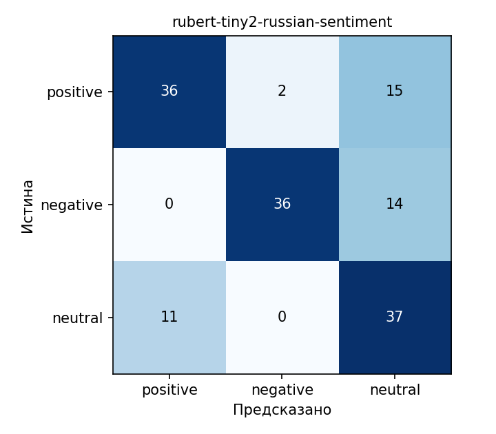

# Задача 1. Анализ тональности русскоязычных отзывов

Часть серии заданий 1 по дисциплине «Программная инженерия» (семестр 1).
Тип задачи: **обработка текста**. Фреймворк: **Hugging Face Transformers** (бэкенд PyTorch).

## Техническое задание

| | |
|---|---|
| **Цель** | Автоматически определять тональность русскоязычных отзывов |
| **Вход** | Строка с текстом отзыва (русский язык, до ~256 токенов) |
| **Выход** | Метка `positive` / `negative` / `neutral` и уверенность `score` (0–1) |
| **Ограничения** | Локальный запуск на CPU / Apple Silicon (MPS) / CUDA без обучения модели |
| **Критерий качества** | Macro-F1 на собственном тестовом наборе не ниже 0.70 |
| **Дальнейшее развитие** | Функция `predict()` из `sentiment.py` будет обёрнута в REST API |

## Модели

Используются две готовые модели с Hugging Face Hub (обе — дообученный RuBERT для трёх классов тональности):

| Модель | Роль | Особенность |
|---|---|---|
| `seara/rubert-tiny2-russian-sentiment` | **Основная** (по умолчанию) | Компактная и быстрая |
| `seara/rubert-base-cased-russian-sentiment` | Для сравнения | Больше размер, ниже скорость |

Основная модель выбрана по результатам сравнения на собственном наборе (см. «Результаты»): качество не хуже, критерий из ТЗ выполняется, модель компактнее и не медленнее.

## Датасет

- Модели обучались авторами на объединении русскоязычных корпусов тональности (в том числе RuReviews и RuSentiment).
- **Важно:** оценка на этих же корпусах была бы завышенной, поэтому качество проверяется на **собственном наборе** `data/test_reviews.csv`.
- Формат: CSV с колонками `text`, `label` (`positive` / `negative` / `neutral`).
- Набор: 151 отзыв (positive — 53, negative — 50, neutral — 48), размечены вручную.
- Отзывы были взяты с различных заведений на Яндекс картах, размечены были мной по моему субьективному взгляду.

## Метрики

- Accuracy, precision / recall / F1 по каждому классу, **macro-F1** (основная метрика — классы сбалансированы, но важна равная цена ошибок по всем трём).
- **95% доверительные интервалы** для accuracy и macro-F1 (bootstrap, 1000 повторов): набор небольшой, поэтому точечные значения нужно читать вместе с интервалом.
- **Парный bootstrap** разницы macro-F1 между моделями — проверяет, значима ли разница.
- Матрица ошибок.
- **Анализ порога уверенности:** как меняются охват и точность, если отбрасывать ответы с `score` ниже порога.
- Скорость: текстов в секунду и миллисекунд на текст.

## Установка и запуск

```bash
cd text
python -m venv .venv
source .venv/bin/activate          # Windows: .venv\Scripts\activate
pip install -r requirements.txt
```

Одиночное предсказание:

```bash
python sentiment.py "Отличный сервис, всем рекомендую!"
# {'label': 'positive', 'score': 0.98}
```

Использование в коде:

```python
from sentiment import predict
predict("Ужасное обслуживание, больше не приду")
```

Оценка качества (по умолчанию обе модели на `data/test_reviews.csv`):

```bash
python evaluate.py
python evaluate.py --data data/my_reviews.csv --models seara/rubert-tiny2-russian-sentiment
```

При первом запуске модели скачиваются с Hugging Face Hub.

## Результаты

Тестовый набор: 151 отзыв. Запуск на Apple M1 (устройство `mps`). Данные: `results/metrics_*.json`, `results/comparison.json`.

| Модель | Accuracy (95% ДИ) | Macro-F1 (95% ДИ) | Текстов/с | мс/текст |
|---|---|---|---|---|
| **rubert-tiny2** | 0.722 (0.649–0.795) | **0.729** (0.657–0.802) | 222 | 4.5 |
| rubert-base-cased | 0.669 (0.596–0.735) | 0.670 (0.591–0.736) | 169 | 5.9 |

**Качество по классам (rubert-tiny2):**

| Класс | Precision | Recall | F1 |
|---|---|---|---|
| positive | 0.77 | 0.68 | 0.72 |
| negative | 0.95 | 0.72 | 0.82 |
| neutral | 0.56 | 0.77 | 0.65 |

**Критерий из ТЗ (macro-F1 ≥ 0.70).** У rubert-tiny2 точечная оценка 0.729, то есть критерий выполнен, но нижняя граница доверительного интервала (0.657) ниже порога: на 151 примере нельзя утверждать это с полной уверенностью. У rubert-base-cased оценка 0.670, критерий не выполнен.

**Сравнение моделей.** Разница macro-F1 (tiny2 − base) составляет +0.060, 95% ДИ [−0.011; +0.134]. Интервал содержит 0, поэтому статистически значимого превосходства tiny2 показать нельзя: корректный вывод — tiny2 **не хуже** base на этом наборе. Это отличается от результатов авторов моделей (у них base чуть лучше tiny), что объясняется другой предметной областью и небольшим размером выборки.

**Скорость.** Замеры на MPS нестабильны: в одном запуске tiny2 оказалась быстрее base примерно в 4 раза (460 против 117 текстов/с), в другом — в 1.3 раза (222 против 169). Надёжно можно утверждать лишь, что tiny2 не медленнее base. Обе модели обрабатывают сотни отзывов в секунду, для задачи этого достаточно.

**Итог выбора.** Основной моделью выбрана rubert-tiny2: качество не хуже, критерий из ТЗ выполняется, модель компактнее.



### Порог уверенности

Если отбрасывать ответы с `score` ниже порога, точность растёт, а охват падает:

| Порог | tiny2: охват | tiny2: accuracy | base: охват | base: accuracy |
|---|---|---|---|---|
| 0.0 | 100% | 0.722 | 100% | 0.669 |
| 0.5 | 96.7% | 0.719 | 98.7% | 0.671 |
| 0.6 | 76.2% | 0.757 | 80.1% | 0.703 |
| 0.7 | 57.6% | 0.805 | 61.6% | 0.753 |
| 0.8 | 33.1% | 0.900 | 42.4% | 0.906 |
| 0.9 | 18.5% | 0.964 | 27.2% | 0.951 |

Средняя уверенность tiny2 на верных ответах 0.76, на ошибочных 0.67, то есть `score` содержит полезный сигнал. На практике можно автоматически принимать ответы с `score ≥ 0.8` (точность около 0.90, но только для трети отзывов), а остальные отправлять на ручную проверку. Порог нужно подбирать под конкретную задачу.

### Анализ ошибок

У rubert-tiny2 42 ошибки из 151. Основные типы:

1. **Позитив, описанный фактами, → neutral (15 ошибок).** Отзывы без эмоциональных слов, где положительная оценка следует из описания: «Уборка в номере каждый день, полотенца меняют, ванная чистая», «Поддержка ответила за пять минут и решила проблему с оплатой». Модель опирается на оценочную лексику, а не на смысл.
2. **Негатив, описанный перечислением претензий, → neutral (14 ошибок).** Например: «Пахнет сыростью при входе, кофе разбавленный, десерт несвежий», «Очередь, а бариста один. Ждал двадцать минут, кофе горчит». Уверенность в таких случаях низкая (часто 0.5–0.7).
3. **Нейтральные отзывы → positive (11 ошибок).** Фактические описания с положительным оттенком: «Куртка соответствует описанию», «Заказ пришёл вовремя, курьер был в форме, всё стандартно». Граница между neutral и слабым позитивом субъективна, часть таких ошибок можно считать спорной разметкой.
4. **Крайние ошибки редки:** positive → negative всего 2, neutral → negative и negative → positive не было. Класс `negative` у tiny2 имеет precision 0.95: если модель сказала «негатив», она почти всегда права.

Самый слабый класс — `neutral` (F1 0.65, precision 0.56): на него «сваливаются» ошибки из двух других классов. У base-модели та же картина выражена сильнее: recall по `negative` всего 0.50 (25 из 50 негативных отзывов признаны нейтральными).

## Ограничения

- Модель ориентирована на короткие тексты; длинные отзывы обрезаются до 256 токенов.
- Сарказм и отзывы со смешанной оценкой распознаются хуже.
- Тональность специфичных предметных областей может отличаться от данных обучения.
- Тестовый набор небольшой, размечен одним человеком; граница между `neutral` и `positive` субъективна.

## Структура

```
text/
├── README.md
├── requirements.txt
├── sentiment.py        # predict(), predict_batch()
├── evaluate.py         # метрики, доверительные интервалы, сравнение моделей
├── data/test_reviews.csv
└── results/            # создаётся при запуске evaluate.py
    ├── metrics_<модель>.json
    ├── predictions_<модель>.csv
    ├── errors_<модель>.csv
    ├── confusion_matrix_<модель>.png
    └── comparison.json
```
